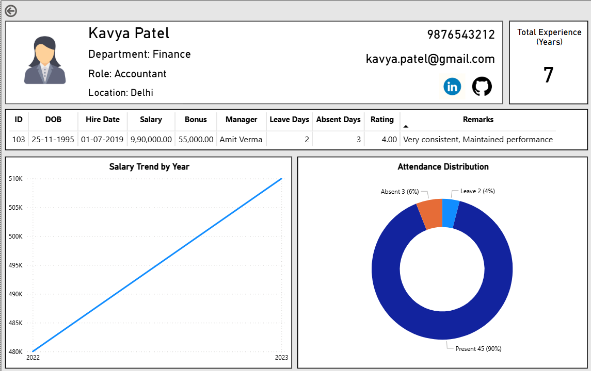

# 📊 Employee Performance Dashboard – Power BI Project

---

## 📌 Project Overview

This project is an interactive **Employee Performance Dashboard** built using **Power BI**.
The dashboard provides insights into employee profiles, salary trends, attendance distribution, and performance ratings.

The goal of this project is to transform raw HR data into meaningful insights using **data modeling, DAX calculations, and interactive visualizations**.

The dashboard allows users to select an employee and navigate to a detailed page showing the employee's profile, experience, salary history, attendance patterns, and performance evaluation.

---

## 🛠 Technologies Used

* **Power BI Desktop**
* **DAX (Data Analysis Expressions)**
* **Data Modeling**

---

## 🗂 Dataset Structure

The project uses a relational HR dataset consisting of the following tables:

* **Employees** – Employee personal and professional information
* **Departments** – Department details and department managers
* **Salaries** – Yearly employee salary and bonus information
* **Attendance** – Present, leave, and absent days for employees
* **Performance** – Employee ratings and performance remarks

The data model includes:

* Primary Keys
* Foreign Key Relationships
* One-to-Many Relationships
* Clean relational structure for analytical reporting

---

## 📊 Dashboard Features

The Power BI dashboard contains the following sections:

### 👤 Employee Profile

Displays basic employee details including:

* Employee Name
* Department
* Job Title
* Location
* Email and Phone
* Years of Experience

---

### 💰 Salary Analysis

Provides insights into employee salary growth.

Visualizations include:

* **Salary Trend Line Chart** – Salary change over years
* **Bonus Analysis** – Bonus distribution across years

---

### 📅 Attendance Insights

Shows employee attendance patterns.

Visualizations include:

* **Attendance Distribution Donut Chart**

  * Present Days
  * Leave Days
  * Absent Days

This helps analyze employee attendance behavior.

---

### ⭐ Performance Evaluation

Displays employee performance insights including:

* Performance Ratings
* Performance Remarks
* Historical review information

---

### 📋 Employee Details Table

A detailed table combining information from multiple tables including:

* Employee ID
* Date of Birth
* Hire Date
* Manager Name
* Salary
* Bonus
* Leave Days
* Absent Days
* Performance Rating
* Remarks

---

## 🔎 Power BI Features Implemented

This project demonstrates several important Power BI concepts:

* Data modeling and relationships
* DAX measures and calculated columns
* Navigation between pages
* Card visuals for key employee metrics
* Interactive filters and context-based visuals
* Multi-table data integration

---

## 📷 Dashboard Preview

---

## 🎯 Key Learning Outcomes

Through this project I gained practical experience in:

* Designing interactive Power BI dashboards
* Creating relationships between multiple tables
* Writing DAX measures for analytics
* Implementing drillthrough navigation
* Visualizing HR analytics data
* Building real-world business intelligence reports

---

## 👩‍💻 Author

**Hemansi**  
Data Analytics & AI/ML Learner  
GitHub: https://github.com/hemansi-data-ai  
